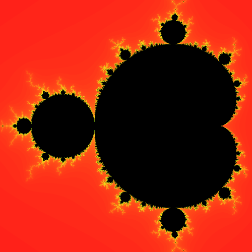

# gm - GPU Mandelbrot

Very simple visualization of the Mandelbrot set run on the GPU.

## Example output

Example image generated using 16 samples.



## Cloning
Clone recursively to get the required submodules, for example with git:

```
git clone https://github.com/lepouki/gm --recursive
```

## Building

Using CMake in the root folder:

```sh
# Create a build folder.
mkdir build

# Run CMake inside and compile the executable.
# The debug build has some additional output so you can add the CMake option
# `-DCMAKE_BUILD_TYPE=Release` to build in release mode.
cd build
cmake ../ && make
```

Or using the CMake GUI.
